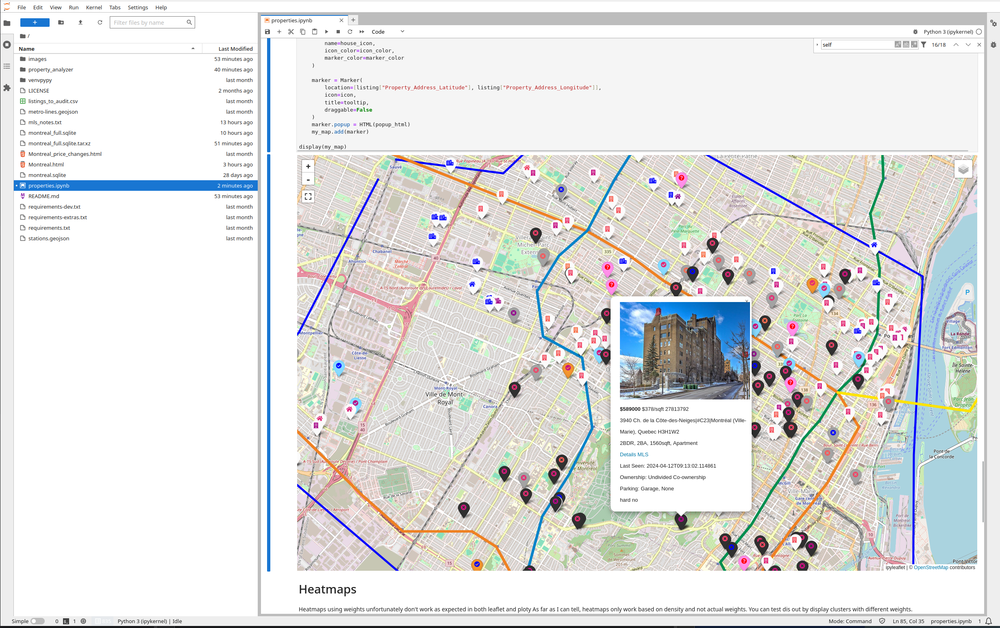

# What
A python script to visualize properties for sale

Also includes a notebook to visualize the same data

# How
- Python
  - Folium/Leaflet, Geopy
- SQLite
  - Custom data scraped using [property-scraper-tools](https://github.com/alexmi256/property-scraper-tools) 

# References
- https://github.com/Jan-Majewski/Project_Portfolio/blob/master/03_Real_Estate_pricing_in_Warsaw/03_02_Data_Vizualization.ipynb
- https://github.com/vfonov/re_mtl?tab=readme-ov-file
- https://m-clark.github.io/generalized-additive-models/appendix.html
- http://www.ilmarin.info/re_mtl/#rent-4-12
- https://martinmcbride.org/post/2021/voronoi-diagrams-with-scipy/
- https://download.geofabrik.de/north-america/canada.html
- https://mapping.share.library.harvard.edu/tutorials/openstreetmap/extractbyfeature/